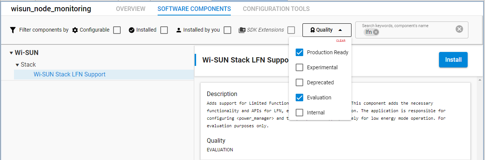
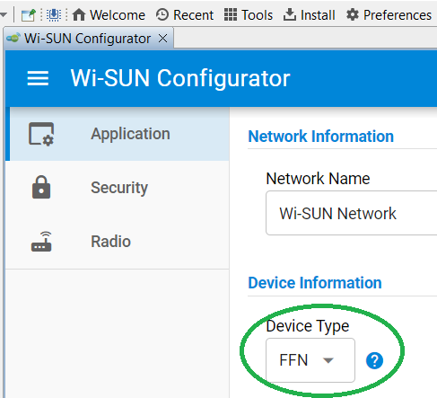
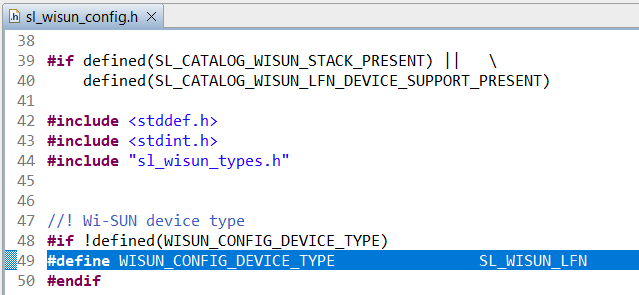

<table border="0">
  <tr>
    <td align="left" valign="middle">
    <h1>Wi-SUN Node Monitoring Application</h1>
  </td>
  <td align="left" valign="middle">
    <a href="https://www.silabs.com/wireless/wi-sun">
      
    </a>
  </td>
  </tr>
</table>


## Summary ##

This project aims to implement a Wi-SUN network monitoring system using a Linux Border Router and a Wi-SUN node monitoring application flashed on [Wi-SUN capable Silicon Labs development kits](https://www.silabs.com/wireless/wi-sun?tab=hardware).

The block diagram of this application is shown in the image below:


- To learn Wi-SUN technology basics, see [the Wi-SUN pages on docs.silabs.com](https://docs.silabs.com/wisun/latest/wisun-start/).

- To learn code-level information on the node monitoring application, see [Add a Custom Application in the Wi-SUN Development Walkthrough](https://docs.silabs.com/wisun/latest/wisun-custom-application/)

## Simplicity SDK Version ##

SiSDK v2025.06.2

## Hardware Required ##

The following is required to run the demo:

- A Linux platform, which will be used as
  - The [Linux Wi-SUN Border Router](https://www.silabs.com/documents/public/application-notes/an1332-wi-sun-network-configuration.pdf#page=8)
  - A UDP receiver, listening for initial connection and regularly sent status messages from all connected Wi-SUN nodes
  - A CoAP client used to get CoAP resources provided by the device application and remotely control some application parameters.
- One [Wi-SUN Evaluation kit](https://www.silabs.com/wireless/wi-sun?tab=kits) used as the Border Router's Wi-SUN RCP (Radio Co-Processor).
- One or more [Wi-SUN Evaluation kit(s)](https://www.silabs.com/wireless/wi-sun?tab=kits) used as the Wi-SUN nodes.

## Connections Required ##

The Wi-SUN RCP (Radio Co-Processor) must be connected to the Linux platform as detailed in [AN1332 Wi-SUN Network Configuration](https://www.silabs.com/documents/public/application-notes/an1332-wi-sun-network-configuration.pdf), either using

- A USB connection between the Linux Platform and a Wi-SUN Pro kit


or

- A Raspberry Pi supporting the RCP Radio Board via a BRD8016A Expansion Board. A BRD8016A board is included in the [Wi-SUN Pro Kits](https://www.silabs.com/wireless/wi-sun?tab=kits) with the Wi-SUN Radio Board


## The Application Requires a Bootloader ##

This example application support OTA DFU, therefore you need to [create and flash a **bootloader**](https://docs.silabs.com/wisun/latest/wisun-ota-dfu/#bootloader-application) to your devices before flashing the **Wi-SUN Node Monitoring** Application.

## Setup ##

A single example application is required in order to use this demonstration: **Wi-SUN Node Monitoring**, created based on **Wi-SUN -SoC Empty** provided by Simplicity Studio.

To test this application, you can

- [Add the 'Wi-SUN Applications' Repository to Simplicity Studio 5](../README.md#add-the-wi-sun-applications-repository-to-simplicity-studio-5)
- Create the Wi-SUN Applications 'Wi-SUN Node Monitoring' Project as described [here](../README.md#create-the-wi-sun-applications-example-projects)

## Communication methods ##

The demonstration uses a Wi-SUN network, supporting

- OTA DFU (this requires using a bootloader with storage enabled and the selected compression mechanism installed)
- CoAP (using the Wi-SUN CoAP Service), because OTA DFU requires CoAP
- UDP client and server (optional), because CoAP is on top of UDP
- TCP client and server (optional)

## How it works ##

### No CLI interface ###

There is no CLI in the Wi-SUN Node Monitoring because it is intended to be as close as possible to a real-life application, where no CLI will be available.

Network parameters are set during project development, then the device automatically connects to the Wi-SUN network. Control of the device is over UDP or COAP from the Border Router, over the Wi-SUN network.

### Wi-SUN Network Set Up ###

- A [Linux Wi-SUN Border Router](https://github.com/SiliconLabs/wisun-br-linux) is set up and started, waiting for Wi-SUN nodes to connect.
- Convenience scripts are copied from [linux_border_router_wsbrd](linux_border_router_wsbrd) to the user's home. Bash scripts are made executable using
  - `chmod a+x coap_all`
  - `chmod a+x ipv6s`
  - `chmod a+x *.sh`
- The 'fd00:6172:6d00::1' (UDP_NOTIFICATION_DEST) IPv6 and the 'fd00:6172:6d00::2' (COAP_NOTIFICATION_DEST) IPv6 are added to eth0 using the `wsbrd_add.sh` script
- Multicast routing via tun0 for all ([link local /realm local] [nodes/routers]) devices is allowed once wsbrd is running (tun0 present) using the `multicast_setup.sh` script
- The [UDP notification receiver](linux_border_router_wsbrd/udp_notification_receiver.py) is started using
  - `python udp_notification_receiver.py 1237 " "`, waiting for messages from the Wi-SUN Nodes on port `1237`.
- The application is built and flashed to all Wi-SUN devices

### Wi-SUN Nodes Connection ###

- The application firmware is configured with the same network settings as the Border Router, with automatic connection.

- **Node Initial Connection** – After the application firmware is installed, the devices connect automatically to the Wi-SUN network, selecting the best parent, using several hops if needed, as in any Wi-SUN network.

- **Initial Connection Message** - Once connected, each node sends an initial UDP connection message via the Border Router to the UDP_NOTIFICATION_DEST IPv6 address (fd00:6172:6d00::1) on port UDP_NOTIFICATION_PORT (1237).

### Buttons and LEDs ###

With version v3.1.0 Button and LEDs control has been added as an option.
To use this, install the following components and create the first 2 instances with default naming:

- `SIMPLE_BUTTON` for `sl_button_btn0` and `sl_button_btn1`
- `SIMPLE_LED` for `sl_led_led0` and `sl_led_led1`

By default, the pintool settings will match the Radio Board pin out.
To allocate different pins to the buttons or LEDs, use the pintool.

> If the above components are not installed, the corresponding code is not compiled.

#### Buttons usage ####

- At boot: The buttons can be pressed to select 4 startup options (options to be implemented)
- While running: When buttons are pressed, a dedicated message is sent to the UDP notification server with the button states. This can be used to identify a device in a network graph.

#### LEDs usage ####

- At boot: A number of flashed (both leds flashing) is done at boot. This can be changed to allow identifying the application's version.
- While connecting: The LEDs indicate the join state as `join_state & 0x03`
- Once connected: The LEDS execute a worm pattern with a 1 sec period. This can be used to make sure the device is still connected and working.
- When sending a message: The LEDS flash briefly

### Network Monitoring ###

- **Automatic Status Messages** – Every `auto_send` seconds (default 60), the connected devices send a status message to the Border Router's IPv6 address on port 1237.

- **Monitoring** – `coap-client` can be used to monitor any connected device. this includes CoAP discovery of the available resources, and retrieving each of these resources at will.

### Network Control ###

- **Controlling Devices** – Some CoAP resources support a payload to control the application settings. The example used in the demo controls the `auto_send` period, which can be increased once the device has been connected for a while, reducing the amount of traffic on the network, which can be important to save power and support many devices.

### Application Parameters ###

The `app_parameters.c/.h` code allows

- Initializing Application Parameters in NVM when no already set
- Retrieving Application Parameters from NVM on boot
- Changing Application Parameters (using CoAP)
- Saving Application parameters to NVM
- Rebooting

It can be easily extended to support any additional application parameter.
See [app_parameters.md](app_parameters.md) for details

### Normal Mode ###

Once all devices are connected, the [`coap_all`](linux_border_router_wsbrd/coap_all) bash script allows sending the same CoAP request to all connected devices, allowing an easy monitoring of the entire network.

### CoAP Install ###

#### libcoap3 installation on Debian versions not supporting it ####

#### Adding missing keys ####

For libcoap3 installation, the following keys need to be installed to allow accessing the bookworm repositories

```bash
sudo apt-key adv --keyserver keyserver.ubuntu.com --recv-keys 0E98404D386FA1D9
sudo apt-key adv --keyserver keyserver.ubuntu.com --recv-keys 9165938D90FDDD2E
sudo apt-key adv --keyserver keyserver.ubuntu.com --recv-keys 6ED0E7B82643E131
```

Depending on the Linux distribution, various `libcoap` versions are available.

- `libcoap2` does not support encryption, and uses `coap-client` to process requests
- `libcoap3` supports encryption, and enforces TLS using `coap-client`. To bypass encryption on the Wi-SUN network (the Wi-SUN data traffic is natively encrypted), use the alternate `coap-client-notls` when using `libcoap3`.

Some Debian distros (such as bullseye) don't support `libcoap3` natively.

To install `libcoap3`

- Check you distro's 'Codename':

```bash
$  lsb_release -a
No LSB modules are available.
Distributor ID: Raspbian
Description:    Raspbian GNU/Linux 11 (bullseye)
Release:        11
Codename:       bullseye
```

Add the 'bookworm' repository list:

```bash
echo "deb http://deb.debian.org/debian bookworm main" | sudo tee /etc/apt/sources.list.d/bookworm.list
```

Install libcoap3

```bash
sudo apt update
sudo apt install -t bookworm libcoap3 libcoap3-bin libcoap3-dev
```

- Then, use `coap-client-notls` instead of `coap-client`

### CoAP Resources ###

The following resources are available via CoAP, split in several groups. To reduce the initial code size, some are only conditionally compiled:

- 'info' for values which will not change over time (these can be checked once only)
- 'statistics' for values accumulated over time
  - 'statistics/app' for values coming from the application
    - 'statistics/app/all' returns all of the app statistics. This is the most commonly used URI
    - Adding '-e reset' resets these statistics
  - 'statistics/stack' for values coming from the stack
    - WARNING: **NO** 'statistics/stack/all' for stack statistics, because the corresponding strings are bigger than the max buffer used. When using stack statistics a user is also generally interested in a single subset of the available statistics.
- 'settings' for parameters of the application we want to check or change via CoAP

The URIs are

| CoAP URI                        | Item                                        | format | Possible payload |
|:--------------------------------|:------------------------------------------- |:-------|:-----------------|
|info/device                      | last 4 digits of device MAC/IPv6 (as in the [wisun-br-gui](https://github.com/SiliconLabs/wisun-br-gui)) | '%04x' ||
|info/chip                        | Silicon Labs part                           | 'xGyy'         ||
|info/board                       | Silicon Labs Radio Board                    | 'BRDxxxxx'     ||
|info/device_type                 | Wi-SUN device type (FFN or LFN)             | '%s'           |'FFN with (no) LFN support' or 'LFN (\<profile\> profile) |
|info/application                 | Application information string              | 'Wi-SUN Node Monitoring' ||
|info/version                     | Application version string                  | 'Compiled on %s at %s' ||
|info/all                         | all of the 'info' group above               | json           ||
|status/running                   | time since application booted               | 'ddd-hh:mm:ss' ||
|status/parent                    | parent tag                                  | '%04x'         ||
|status/neighbor                  | number of neighbors                         | '%d'           | '-e n' returns info for neighbor n (from [sl_wisun_neighbor_info_t](https://docs.silabs.com/wisun/latest/wisun-stack-api/sl-wisun-neighbor-info-t) |
|status/connected                 | time since last connection                  | 'ddd-hh:mm:ss' ||
|status/all                       | all of the 'status' group above             | json           ||
|status/send                      | Trigger an immediate Tx of status_json_string() | json           | Same message as sent to UDP server|
|statistic/app/join_states_sec    | array of seconds spent to reach each join state (1 to 5) | 'ddd-hh:mm:ss' ||
|statistic/app/disconnected_total |  | 'ddd-hh:mm:ss' ||
|statistic/app/connections        |  | '%d'           ||
|statistic/app/connected_total    |  | 'ddd-hh:mm:ss' ||
|statistic/app/availability       |  | '%6.2f'        ||
|statistic/app/all                | all of the 'statistics/app' group above     | json ||
|statistics/stack/phy             | statistics from [sl_wisun_statistics_phy_t](https://docs.silabs.com/wisun/latest/wisun-stack-api/sl-wisun-statistics-phy-t)               | json | '-e reset' resets these statistics |
|statistics/stack/mac             | statistics from [sl_wisun_statistics_mac_t](https://docs.silabs.com/wisun/latest/wisun-stack-api/sl-wisun-statistics-mac-t)               | json | '-e reset' resets these statistics |
|statistics/stack/fhss            | statistics from [sl_wisun_statistics_fhss_t](https://docs.silabs.com/wisun/latest/wisun-stack-api/sl-wisun-statistics-fhss-t)             | json | '-e reset' resets these statistics |
|statistics/stack/wisun           | statistics from [sl_wisun_statistics_wisun_t](https://docs.silabs.com/wisun/latest/wisun-stack-api/sl-wisun-statistics-wisun-t)           | json | '-e reset' resets these statistics |
|statistics/stack/network         | statistics from [sl_wisun_statistics_network_t](https://docs.silabs.com/wisun/latest/wisun-stack-api/sl-wisun-statistics-network-t)       | json | '-e reset' resets these statistics |
|statistics/stack/regulation      | statistics from [sl_wisun_statistics_regulation_t](https://docs.silabs.com/wisun/latest/wisun-stack-api/sl-wisun-statistics-regulation-t) | json | '-e reset' resets these statistics |
|settings/auto_send               | the current `auto_send_sec` value           | '%d' | '-e s' sets auto_send_sec to s seconds |
|settings/trace_level             | the current `trace_level` value             | '%d' | '-e \<level\>' - '-e [0-4]' sets trace_level for all groups. '-e \<group\> \<level\>' sets trace level for a single group. Groups are [(0=None to 4=DEBUG)](https://docs.silabs.com/wisun/latest/wisun-stack-api/sl-wisun-types#sl-wisun-trace-level-t). Levels are [(0=MAC to 41=APP)](https://docs.silabs.com/wisun/latest/wisun-stack-api/sl-wisun-types#sl-wisun-trace-group-t) |
|settings/parameter               | set/get application parameters to/from NVM  | '%d' | '-e \<name\>' returns current parameter value. '-e \<name\> \<value\>' changes application parameter value. See for details |
|reporter/crash                   | Info on any previous crash, using `sl_wisun_crash_handler.c/.h` | '%s' | text info on crash (from `sl_wisun_crash_handler.h/sl_wisun_crash_type`) |
|reporter/start                   | Start RTT trace filtering on \<str\> and report on `REPORTER_PORT`, using `app_reporter.c/.h`  | '%s'| '-e \<string_1\|string_2\|...\|string_n\>' sets the list of strings to look for in RTT traces. |
|reporter/stop                    | Stop RTT trace reporting |||

### CoAP request examples ###

- Get auto_send duration: GET method

```bash
coap-client -m get -N -B 10 -t text coap://[fd12:3456::62a4:23ff:fe37:aec3]:5683/settings/auto_send
```

- Set auto_send duration: POST method

```bash
coap-client -m post -N -B 10 -t text coap://[fd12:3456::62a4:23ff:fe37:aec3]:5683/settings/auto_send -e 60
```

- Set trace group [SL_WISUN_TRACE_GROUP_RF](https://docs.silabs.com/wisun/latest/wisun-stack-api/sl-wisun-trace-group-config-t#group-id) to trace_level [SL_WISUN_TRACE_LEVEL_DEBUG](https://docs.silabs.com/wisun/latest/wisun-stack-api/sl-wisun-trace-group-config-t#trace-level)

```bash
coap-client -m post -N -B 10 -t text coap://[fd12:3456::62a4:23ff:fe37:aec3]:5683/settings/trace_level -e "34 4"
```

## .slcp Project Used ##

- [wisun_node_monitoring.slcp](https://github.com/SiliconLabs/wisun_applications/blob/main/wisun_node_monitoring/wisun_node_monitoring.slcp)

## Selecting Notification Messages Items ##

It is easy to customize the notification messages in [`app.c`](https://github.com/SiliconLabs/wisun_applications/blob/main/wisun_node_monitoring/app.c)

- Device info
  - Remove/Add/Order lines in the `DEVICE_CHIP_ITEMS` and `DEVICE_CHIP_JSON_FORMAT` macros to match your needs
- Parent info
  - Remove/Add/Order lines in the `PARENT_INFO_ITEMS` and `PARENT_JSON_FORMAT` macros to match your needs
- Initial connection info
  - Remove/Add/Order lines in the `CONNECTION_JSON_FORMAT_STR` macro and in the [_connection_json_string()/snprintf()](https://github.com/SiliconLabs/wisun_applications/blob/main/wisun_node_monitoring/app.c#L770) call to match your needs
- Connected status info
  - Remove/Add/Order lines in the `CONNECTED_JSON_FORMAT_STR` macro and in the [_status_json_string()/snprintf()](https://github.com/SiliconLabs/wisun_applications/blob/main/wisun_node_monitoring/app.c#814) calls (also change the [second call](https://github.com/SiliconLabs/wisun_applications/blob/main/wisun_node_monitoring/app.c#L842) ) to match your needs
- Sensor info
  - Add similar text to the `json_string` in [_status_json_string()](https://github.com/SiliconLabs/wisun_applications/blob/main/wisun_node_monitoring/app.c#L785) to track any sensor info. This may require making the information available to `app.c` by including the header file for you metering code.

## How to Port to Another Part ##

- Connect the new hardware with the new part
- Select it in Simplicity Studio
- Create, build and flash a **bootloader** application to your device (the application supports OTA DFU, which requires a bootloader)
- [Add the 'Wi-SUN Applications' Repository to Simplicity Studio 5](https://github.com/SiliconLabs/wisun_applications/blob/main/README.md#add-the-wi-sun-applications-repository-to-simplicity-studio-5)
- In the Launcher's EXAMPLE PROJECTS & DEMOS, Select **wisun_applications** in the 'Provider' Area (at the bottom of the list)
  - if the project doesn't appear in the list
    - Uncheck all filter boxes in the filter area except **wisun_applications**
    - Check that your hardware is compatible with Wi-SUN (it should be possible to create Wi-SUN projects)
- Create a new **Wi-SUN Node Monitoring Application** project
- Use the Wi-SUN Configurator to set the Network (Name/Tx power/PHY) to match the Border Router settings
- Use the SOFTWARE COMPONENTS/Wi-SUN Over-The-Air Device Firmware Upgrade (OTA DFU) GUI or `config/sl_wisun_ota_dfu_config.h` to set OTA DFU to match the Border Router settings

## LFN parenting and LFN device ##

(Refer to [LFN in Silicon Labs Wi-SUN Stack](https://docs.silabs.com/wisun/latest/wisun-lfn/#lfn-in-silicon-labs-wi-sun-stack) for details on Wi-SUN LFN, including power management aspects)

Adding the **Wi-SUN Stack LFN Support** component is required to turn the device into a LFN.

With SiSDK 2024-6, the 'Wi-SUN Stack LFN Support' component is listed with 'Evaluation' quality in Simplicity Studio, so it is found in the 'SOFTWARE COMPONENTS' once the 'Evaluation' level has been selected in the 'Quality' drop down list.



Install this component to get access to the 'Device Type' Drop down box in the Wi-SUN Configurator.



This box selects the value set for `WISUN_CONFIG_DEVICE_TYPE` in `autogen\sl_wisun_config.h`.



## Access to RTT traces ##

The project being based on Wi-SUN SoC Empty, which doesn't include the **wisun_stack_debug** component, this component is added to the `.slcp` file. This can be uninstalled for release versions of the application.
When this component is uninstalled, the `app_reporter.c/.h` files need to be removed from the project and the `#include "app_reporter.h"` line commented in `app_coap.c`.

## Debug Tools ##

### Crash handler ###

The [crash handler component](https://github.com/SiliconLabs/wisun_applications/tree/main/component/crash_handler) is used to retrieve information on any previous crash.
This information is printed at boot to the console and RTT traces, then transmitted once to the UDP notification server upon the first connection.
It is also available using the '/reporter/crash' CoAP request.

- It allows getting useful information on previous crashes from the Border Router over the Wi-SUN network, even with no RTT trace active at the time of the crash.
  - In case of [SL_WISUN_CRASH_TYPE_FAULT](https://github.com/SiliconLabs/wisun_applications/blob/main/component/crash_handler/sl_wisun_crash_handler.c#L383), look for LR in the .map file as the source of the fault (look for the function where the LR value belongs to).
- It also triggers a `NVIC_SystemReset()` call, to get the device out of the crash.
  - In case of a systematic application crash (a common situation during development when components are not started in the correct order), this will result in a never ending reboot loop, which is easy to detect during development when looking at RTT traces.

### RTT reporter ###

The [RTT reporter code](https://github.com/SiliconLabs/wisun_applications/blob/main/wisun_node_monitoring/app_reporter.c) is used to filter RTT traces for a set of text strings and report these to the Border Router.

Among other uses, it can be useful in

- Checking if other devices receive any frame from missing devices:
  - Send a multicast `/reporter/start -e ""` request with the last bytes of the missing devices MAC addresses
  - `coap-client -m get -N -B 10 -t text coap://[ff03::1]:5683/reporter/start  -e  "26:cc,\|2c:37,\|2b:c4,"`
  - (the pipe `|` character needs to be escaped to avoid its interpretation by the shell)
- Checking if other devices receive any frame from missing devices:
  - Send a multicast `/reporter/start -e ""` request with the last bytes of the missing devices MAC addresses
  - `coap-client -m get -N -B 10 -t text coap://[ff03::1]:5683/reporter/start  -e  "26:cc,\|2c:37,\|2b:c4,"`
  - (the pipe `|` character needs to be escaped to avoid its interpretation by the shell)
- Checking if a given device still receives frames from one of its children
  - Similar to above, with the (unicast) Ipv6 address of the parent device
  - Similar to above, with the (unicast) Ipv6 address of the parent device
- Gathering any interesting RTT trace from a device
  - Send a unicast `/reporter/start -e ""` request to the device with match string for the traces you want to check
  - `coap-client -m get -N -B 10 -t text coap://[fd12:3456::2adb:a7ff:fe77:2c6b]:5683/reporter/start  -e  "Tx PA\|TX PC"`

#### Locating the Reporter Code ####

Search for `WITH_REPORTER` to locate the corresponding code blocks

The RTT reporter can be removed from the application by:

- Commenting the `#define WITH_REPORTER` line
- (Optionally) Removing the `app_reporter.c/.h` files

### Wi-SUN Direct Connect ###

Wi-SUN Direct Connect allows connecting to a Wi-SUN device even when it's not connected to the normal Wi-SUN network in a secure manner

See the [Silicon Labs Direct Connect Tool documentation](https://docs.silabs.com/wisun/latest/wisun-direct-connect/) for details.

This repository contains an example implementation of Direct Connect with the following features:

- Automatic connection to the Direct Connect host when receiving a Direct Connect 'Link Available'event.
- Automatic transmission of RTT traces once connected (to the Direct Connect host, on REPORTER_PORT = 377e)
  - The [direct_connect_receiver.py](linux_border_router_wsbrd/direct_connect_receiver.py) script can be used to monitor the traces.
- Minimal Direct Connect CLI
  - Sending commands via [direct_connect_cli.py](linux_border_router_wsbrd/direct_connect_cli.py)
  - Receiving replies in the [direct_connect_receiver.py](linux_border_router_wsbrd/direct_connect_receiver.py)
  - Automatic transmission of most console traces
    - Because the Wi-SUN Node Monitoring application copies most of the console traces to RTT traces, these are also transmitted.
  - Control of the RTT traces groups and trace levels
    - The syntax is similar to the 'wisun set_trace_level'command of the Wi-SUN SoC CLI application
  - Allows checking the crash handler result
    - Send `wisun crash_report`

In the Wi-SUN Node Monitoring application, Direct Connect is used to retrieve RTT traces (using the [reporter](https://github.com/SiliconLabs/wisun_applications/blob/main/wisun_node_monitoring/README.md#wi-sun-direct-connect)) over a wireless 1-on-1 connection with a device, based on:

- A shared PMK, present [in the application](https://github.com/SiliconLabs/wisun_applications/blob/main/wisun_node_monitoring/app_direct_connect.c#L65) and in the [`direct_connect.conf`](https://github.com/SiliconLabs/wisun_applications/blob/main/wisun_node_monitoring/linux_border_router_wsbrd/direct_connect.conf) file.
- The MAC(EUI64) of the device (now traced at startup and part of the notification messages)

Search for `WITH_DIRECT_CONNECT` to locate the corresponding code blocks

#### Direct Connect example ####

1- Start the Direct Connect receiver

```bash
$ direct_connect_receiver.py 3770
[2025-02-06 15:34:16] Receiving on ::/3770...
```

2- Initiate the Direct Connect connection

```bash
$ direct_connect.sh 28:db:a7:ff:fe:77:2c:ad
Silicon Labs Wi-SUN Direct Connect v2.2
Connected to RCP "2.3.0" (2.3.0), API 2.5.0
Silicon Labs Wi-SUN Direct Connect successfully started
```

3- Wait for Direct Connect connection (timing out after 60 sec)

```bash
Direct Connection established with 28:db:a7:ff:fe:77:2c:ad
28:db:a7:ff:fe:77:2c:ad reachable at fe80::2adb:a7ff:fe77:2cad
```

Once connected, you can retrieve the IPv6 address used for Direct Connect (`fe80::2adb:a7ff:fe77:2cad` above) to send UDP messages to the device:

```bash
 $ direct_connect_cli.py

# Call with
# Direct_Connect_CLI <Direct_Connect_Ipv6>  <7777>  "<message string>"
# Direct_Connect_CLI  fe80::2adb:a7ff:fe77:2bc4  7777 "wisun set_trace_level 2"
# Direct_Connect_CLI  fe80::2adb:a7ff:fe77:2bc4  7777 "wisun set_trace_level 16 3"
```

The [application CLI](https://github.com/SiliconLabs/wisun_applications/blob/main/wisun_node_monitoring/app_direct_connect.c#L174) can be used to control RTT traces, using [trace groups](https://github.com/SiliconLabs/simplicity_sdk/blob/sisdk-2024.12/protocol/wisun/stack/inc/sl_wisun_types.h#L877) and [trace levels](https://github.com/SiliconLabs/simplicity_sdk/blob/sisdk-2024.12/protocol/wisun/stack/inc/sl_wisun_types.h#L936) and can be extended at will.

```bash
direct_connect_cli.py fe80::2adb:a7ff:fe77:2cad 7777 "wisun set_trace_level 45"
```

>NB: The replies will be visible in the Direct Connect receiver console

#### Locating the Direct Connect code ####

Search for `WITH_DIRECT_CONNECT` to locate the corresponding code

The Direct Connect code can be removed from the application by:

- Commenting the `#define WITH_DIRECT_CONNECT` line
- (Optionally) Removing the `app_direct_connect.c/.h` files
