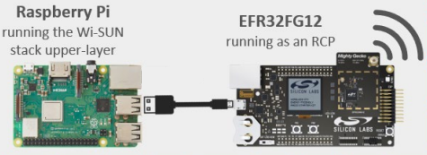
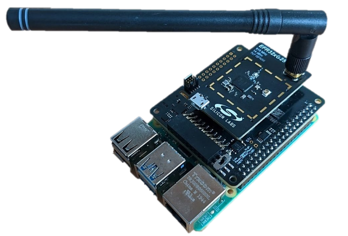

<table border="0">
  <tr>
    <td align="left" valign="middle">
    <h1>Wi-SUN Node Monitoring Application</h1>
  </td>
  <td align="left" valign="middle">
    
  </td>
  </tr>
</table>

## Summary ##

This project aims to implement a Wi-SUN network monitoring system using a Linux Border Router and a Wi-SUN node monitoring application flashed on [Wi-SUN capable Silicon Labs development kits](https://www.silabs.com/wireless/wi-sun?tab=hardware).

The block diagram of this application is shown in the image below:

- To learn Wi-SUN technology basics, see [the Wi-SUN pages on docs.silabs.com](https://docs.silabs.com/wisun/latest/wisun-start/).

- To learn code-level information on the node monitoring application, see [Add a Custom Application in the Wi-SUN Development Walkthrough](https://docs.silabs.com/wisun/latest/wisun-custom-application/)

## Gecko SDK Version ##

GSDK v4.4.0

## Hardware Required ##

The following is required to run the demo:

- A Linux platform, which will be used as
  - The [Linux Wi-SUN Border Router](https://www.silabs.com/documents/public/application-notes/an1332-wi-sun-network-configuration.pdf#page=8)
  - A UDP receiver, listening for initial connection and regularly sent status messages from all connected Wi-SUN nodes
  - A CoAP client used to get CoAP resources provided by the device application and remotely control some application parameters.
- One [Wi-SUN Evaluation kit](https://www.silabs.com/wireless/wi-sun?tab=kits) used as the Border Router's Wi-SUN RCP (Radio Co-Processor).
- One or more [Wi-SUN Evaluation kit(s)](https://www.silabs.com/wireless/wi-sun?tab=kits) used as the Wi-SUN nodes.

## Connections Required ##

The Wi-SUN RCP (Radio Co-Processor) must be connected to the Linux platform as detailed in [AN1332 Wi-SUN Network Configuration](https://www.silabs.com/documents/public/application-notes/an1332-wi-sun-network-configuration.pdf), either using

- A USB connection between the Linux Platform and a Wi-SUN Pro kit

or

- A Raspberry Pi supporting the RCP Radio Board via a BRD8016A Expansion Board. A BRD8016A board is included in the [Wi-SUN Pro Kits](https://www.silabs.com/wireless/wi-sun?tab=kits) with the Wi-SUN Radio Board

## The Application Requires a Bootloader ##

This example application support OTA DFU, therefore you need to create and flash a **bootloader** to your devices before flashing the **Wi-SUN Node Monitoring** Application.

## Setup ##

A single example application is required in order to use this demonstration: **Wi-SUN Node Monitoring**, created based on **Wi-SUN -SoC Empty** provided by Simplicity Studio.

To test this application, you can

- [Add the 'Wi-SUN Applications' Repository to Simplicity Studio 5](../README.md#add-the-wi-sun-applications-repository-to-simplicity-studio-5)
- Create the Wi-SUN Applications 'Wi-SUN Node Monitoring' Project as described [here](../README.md#create-the-wi-sun-applications-example-projects)

## Communication methods ##

The demonstration uses a Wi-SUN network, supporting

- UDP (natively)
- CoAP (using the Wi-SUN CoAP Service)
- OTA DFU (this requires using a bootloader with storage enabled and the selected compression mechanism installed)

## How it works ##

### Wi-SUN Network Set Up ###

- A [Linux Wi-SUN Border Router](https://github.com/SiliconLabs/wisun-br-linux) is set up and started, waiting for Wi-SUN nodes to connect.
- Convenience scripts are copied from [linux_border_router_wsbrd](linux_border_router_wsbrd) to the user's home. Bash scripts are made executable using
  - `chmod a+x coap_all`
  - `chmod a+x ipv6s`
  - `chmod a+x *.sh`
- The [UDP notification receiver](linux_border_router_wsbrd/udp_notification_receiver.py) is started using
  - `python udp_notification_receiver.py 1237 " "`, waiting for messages from the Wi-SUN Nodes on port `1237`.
- The application is built and flashed to all Wi-SUN devices

### Wi-SUN Nodes Connection ###

- The application firmware is configured with the same network settings as the Border Router, with automatic connection.

- **Node Initial Connection** – After the application firmware is installed, the devices connect automatically to the Wi-SUN network, selecting the best parent, using several hops if needed, as in any Wi-SUN network.

- **Initial Connection Message** - Once connected, each node sends an initial UDP connection message to the Border Router's IPv6 address on port 1237.

### Network Monitoring ###

- **Automatic Status Messages** – Every `auto_send` seconds (default 60), the connected devices send a status message to the Border Router's IPv6 address on port 1237.

- **Monitoring** – `coap-client` can be used to monitor any connected device. this includes CoAP discovery of the available resources, and retrieving each of these resources at will.

### Network Control ###

- **Controlling Devices** – Some CoAP resources support a payload to control the application settings. The example used in the demo controls the `auto_send` period, which can be increased once the device has been connected for a while, reducing the amount of traffic on the network, which can be important to save power and support many devices.

### Normal Mode ###

Once all devices are connected, the [`coap_all`](linux_border_router_wsbrd/coap_all) bash script allows sending the same CoAP request to all connected devices, allowing an easy monitoring of the entire network.

### CoAP Resources ###

The following resources are available via CoAP, split in several groups. To reduce the initial code size, some are only conditionally compiled:

- 'statistics' for values accumulated over time
  - 'statistics/app' for values coming from the application
    - 'statistics/app/all' returns all of the app statistics. This is the most commonly used URI
    - Adding '-e reset' resets these statistics
  - 'statistics/stack' for values coming from the stack
    - WARNING: **NO** 'statistics/stack/all' for stack statistics, because the corresponding strings are bigger than the max buffer used. When using stack statistics a user is also generally interested in a single subset of the available statistics.
- 'settings' for parameters of the application we want to check or change via CoAP

The URIs are

| CoAP URI                        | Item                                        | format | Possible payload |
|:--------------------------------|:------------------------------------------- |:-------|:-----------------|
|info/device                      | last 4 digits of device MAC/IPv6 (as in the [wisun-br-gui](https://github.com/SiliconLabs/wisun-br-gui)) | '%04x' ||
|info/chip                        | Silicon Labs part                           | 'xGyy'         ||
|info/board                       | Silicon Labs Radio Board                    | 'BRDxxxxx'     ||
|info/application                 | Application information string              | 'Wi-SUN Node Monitoring' ||
|info/version                     | Application version string                  | 'Compiled on %s at %s' ||
|info/all                         | all of the 'info' group above               | json           ||
|status/running                   | time since application booted               | 'ddd-hh:mm:ss' ||
|status/parent                    | parent tag                                  | '%04x'         ||
|status/neighbor                  | number of neighbors                         | '%d'           | '-e n' returns info for neighbor n (from [sl_wisun_neighbor_info_t](https://docs.silabs.com/wisun/latest/wisun-stack-api/sl-wisun-neighbor-info-t) |
|status/connected                 | time since last connection                  | 'ddd-hh:mm:ss' ||
|status/all                       | all of the 'status' group above             | json           ||
|statistic/app/join_states_sec    | array of seconds spent to reach each join state (1 to 5) | 'ddd-hh:mm:ss' ||
|statistic/app/disconnected_total |  | 'ddd-hh:mm:ss' ||
|statistic/app/connections        |  | '%d'           ||
|statistic/app/connected_total    |  | 'ddd-hh:mm:ss' ||
|statistic/app/availability       |  | '%6.2f'        ||
|statistic/app/all                | all of the 'statistics/app' group above     | json ||
|statistics/stack/phy             | statistics from [sl_wisun_statistics_phy_t](https://docs.silabs.com/wisun/latest/wisun-stack-api/sl-wisun-statistics-phy-t)               | json | '-e reset' resets these statistics |
|statistics/stack/mac             | statistics from [sl_wisun_statistics_mac_t](https://docs.silabs.com/wisun/latest/wisun-stack-api/sl-wisun-statistics-mac-t)               | json | '-e reset' resets these statistics |
|statistics/stack/fhss            | statistics from [sl_wisun_statistics_fhss_t](https://docs.silabs.com/wisun/latest/wisun-stack-api/sl-wisun-statistics-fhss-t)             | json | '-e reset' resets these statistics |
|statistics/stack/wisun           | statistics from [sl_wisun_statistics_wisun_t](https://docs.silabs.com/wisun/latest/wisun-stack-api/sl-wisun-statistics-wisun-t)           | json | '-e reset' resets these statistics |
|statistics/stack/network         | statistics from [sl_wisun_statistics_network_t](https://docs.silabs.com/wisun/latest/wisun-stack-api/sl-wisun-statistics-network-t)       | json | '-e reset' resets these statistics |
|statistics/stack/regulation      | statistics from [sl_wisun_statistics_regulation_t](https://docs.silabs.com/wisun/latest/wisun-stack-api/sl-wisun-statistics-regulation-t) | json | '-e reset' resets these statistics |
|settings/auto_send               | the current `auto_send_sec` value           | '%d' | '-e s' sets auto_send_sec to s     |
|settings/trace_level             | the current `trace_level` value             | '%d' | '-e [0-4]' sets trace_level [(0=None to 4=DEBUG)](https://docs.silabs.com/wisun/latest/wisun-stack-api/sl-wisun-types#sl-wisun-trace-level-t) |

## .slcp Project Used ##

- [wisun_node_monitoring.slcp](https://github.com/SiliconLabs/wisun_applications/blob/main/wisun_node_monitoring/wisun_node_monitoring.slcp)

## How to Port to Another Part ##

- Connect the new hardware with the new part
- Select it in Simplicity Studio
- Create, build and flash a **bootloader** application to your device (the application supports OTA DFU, which requires a bootloader)
- [Add the 'Wi-SUN Applications' Repository to Simplicity Studio 5](https://github.com/SiliconLabs/wisun_applications/blob/main/README.md#add-the-wi-sun-applications-repository-to-simplicity-studio-5)
- In the Launcher's EXAMPLE PROJECTS & DEMOS, Select **wisun_applications** in the 'Provider' Area (at the bottom of the list)
  - if the project doesn't appear in the list
    - Uncheck all filter boxes in the filter area except **wisun_applications**
    - Check that your hardware is compatible with Wi-SUN (it should be possible to create Wi-SUN projects)
- Create a new **Wi-SUN Node Monitoring Application** project
- Use the Wi-SUN Configurator to set the Network (Name/Tx power/PHY) to match the Border Router settings
- Use the SOFTWARE COMPONENTS/Wi-SUN Over-The-Air Device Firmware Upgrade (OTA DFU) GUI or `config/sl_wisun_ota_dfu_config.h` to set OTA DFU to match the Border Router settings

## Access to RTT traces

The project being based on Wi-SUN SoC Empty, which doesn't include the **wisun_stack_debug** component, this component is added to the `.slcp` file. This can be uninstalled for release versions of the application.
