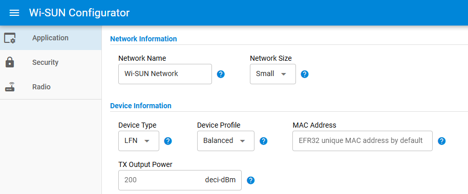

# LFN Specifics

The project is similar to [the FFN project](README.md), except that it runs with the power_manager_deepsleep component installed and requires specific low power settings to be power efficient in EM2.

## Settings Which need to be set manually

This paragraph describes required steps to enable low_power EM2, given that some can't be achieved at project level.

### Setting Device Type as 'LFN'

Use the Wi-SUN Configurator to set the device type to 'LFN' and set the 'Device Profile'

### Guarding against incorrect low-power settings

To make sure all settings are correct, [lfn_checks.h](lfn_checks.h) is added to the project to raise `#pragma` messages on critical settings.
This file can also be added to any LFN project, in order to make sure all settings are correct even for projects not based on the Wi-SUN Node Monitoring Application.

- For each message, go the the corresponding line in [lfn_checks.h](lfn_checks.h) and use 'Go to definition' to go directly to the settings, and correct the value.
